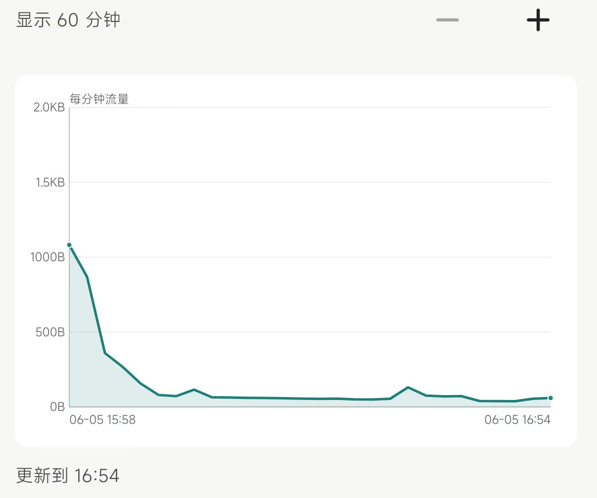
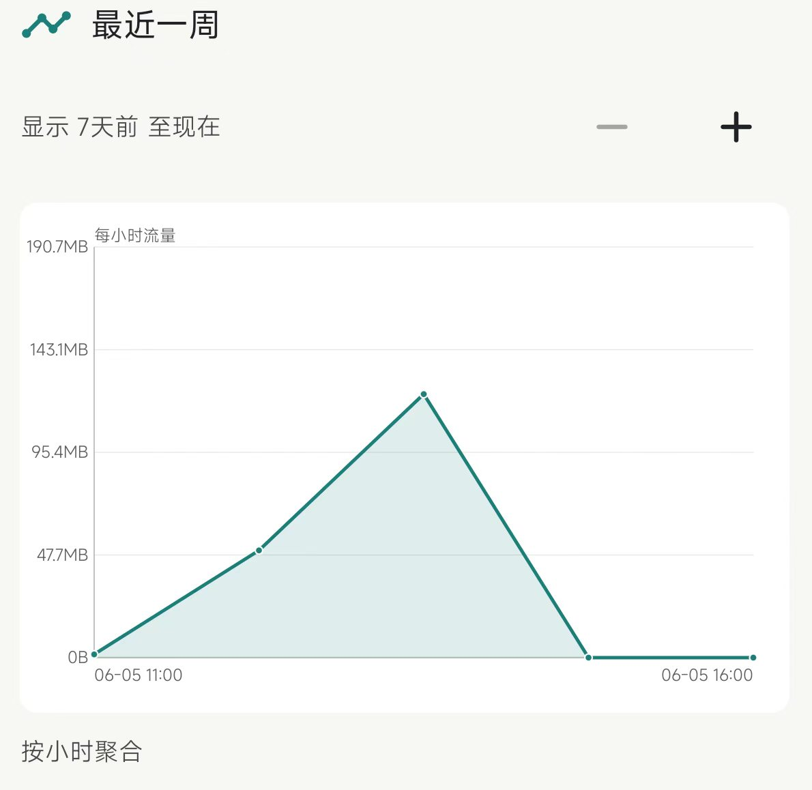
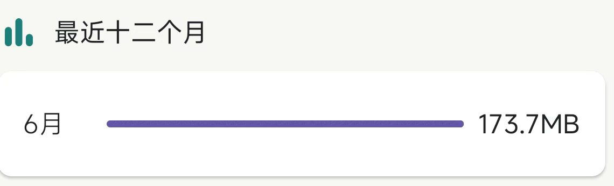
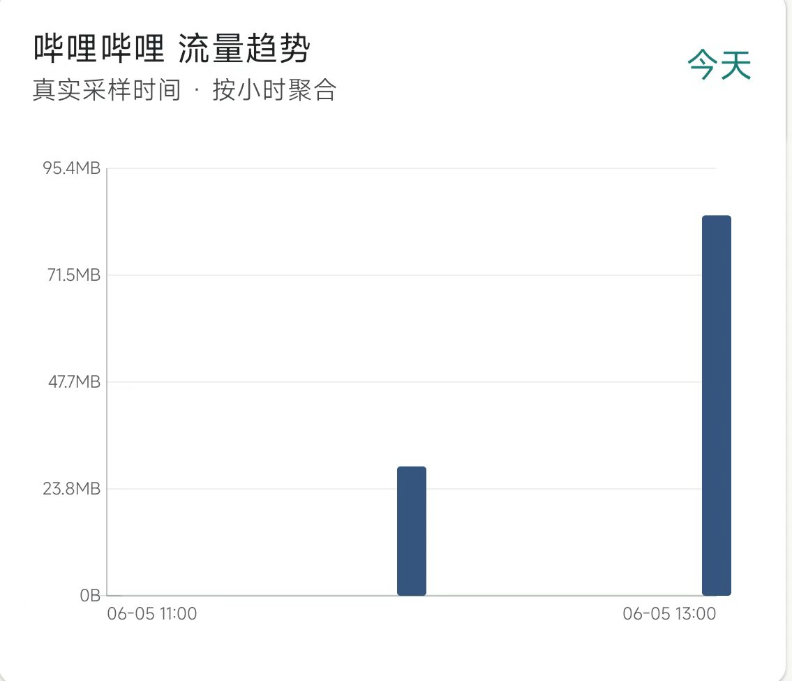
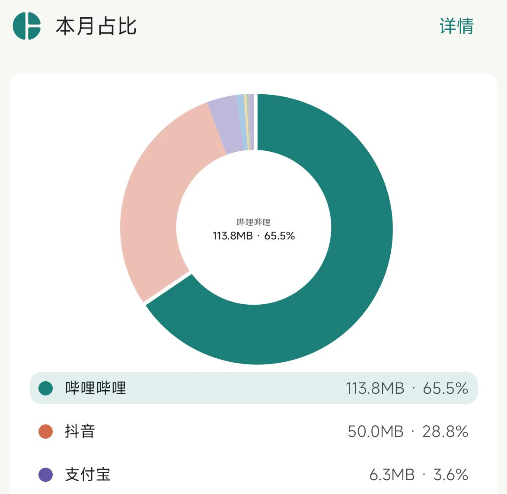

# TrafficWatch

学生卡的地区流量，正常情况在学校用不完，视频随便刷，热点到哪里都开着，也不用wifi，属于是富的流油
但上个月出来实习，到了新的城市，在月中的时候通用流量就用
完了，虽然后面意识到了导出蹭wifi，但是上个月的话费也是飙升到了惊人的109元🤦‍♂️(第一个月的实习生有多穷懂得都懂)，我急于想弄清楚各个app消耗流量的情况，然后对症下药，于是这个专门监测流量使用的app TrafficWatch就诞生了

- 安卓14可以稳定运行，不支持ios系统

## 主要功能

- 记录最近一小时的流量使用情况(精确到分钟)

- 记录最近一个月的使用情况(精确到小时)

- 记录最近一年的使用情况(精确到月)
    - 每个app都有单独的树状图记录

- 直观展示不同app的流量使用情况

- 支持记录热点的流量消耗

- 支持双卡流量卡监测

- 支持wifi和流量同时开着进行监测

- 支持小组件功能，可以在后台稳定运行

- 固定签名，对app进行更新，旧数据不会消失，可以继续使用

## 使用方法

1. 下载apk即可
    - 下载链接：[点这里](https://github.com/yhbshishuaige/TrafficWatchAPP/releases/tag/v1.1.3)

2. 在文件管理器中安装

3. 进入app后，找到设置，一句对应提示找到对应权限

4. 手动输入你要监测的卡，包括
    - 手机号
    - 运营商
    - 卡槽

5. 回到首页点击开启监测即可

6. 小组件的使用，回到桌面，添加小组件，选择全部应用，找到安卓小组件，进去之后滑倒底部即可找到，添加应用即可
    - 推荐使用小组件，方便开关应用监测

7. 关于更新：直接下载最新版的apk，然后安装即可，新版本会继续使用上个版本的监测数据，不必担心数据丢失

## 版本号规则

版本号使用 `主版本.次版本.修订版本`：

- 主版本号变化意味着大更新，可能会出现不兼容的情况
- 此版本号变化一般是添加新功能
- 修订版本号变化一般是优化细节
